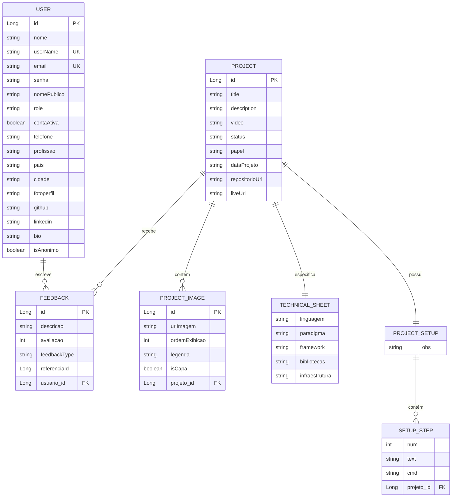

<div align="center">

# 🧑‍💻 BrunoFragaDev — Portfolio API

**API RESTful de produção que serve a plataforma [brunofragadev.com](https://www.brunofragadev.com).**  
Autenticação completa, gerenciamento de portfólio, artigos e sistema de feedbacks.

[](https://openjdk.org/projects/jdk/21/)
[](https://spring.io/projects/spring-boot)
[](https://spring.io/projects/spring-security)
[](https://developers.google.com/identity)
[](https://swagger.io)
[](https://www.brevo.com)
[](https://www.mysql.com)
[](./LICENSE)

🔗 **[brunofragadev.com](https://www.brunofragadev.com)**

</div>

---

## 📖 Sobre o Projeto

Backend da plataforma **[brunofragadev.com](https://www.brunofragadev.com)** — um sistema de portfólio pessoal com autenticação completa, gerenciamento de projetos, artigos e coleta de feedbacks de usuários reais.

Este projeto foi desenvolvido simulando um **ambiente de produção real**, com foco em:

- 🏗️ **Clean Architecture + DDD** — domínio isolado de frameworks
- 🔒 **Segurança robusta** — JWT + Google OAuth2 + controle de acesso por roles
- 📬 **Comunicação assíncrona** — e-mails transacionais via Brevo API (WebClient)
- ⚡ **Design stateless** — escalabilidade horizontal sem estado de sessão
- 🧪 **Testabilidade** — Use Cases com responsabilidade única (SRP)

---

## ✨ Funcionalidades Completas

### 🔐 Módulo de Autenticação (`/auth`)

- Login com **credenciais** (username/senha) com geração de token **JWT** (`POST /auth/login`)
- Login social via **Google OAuth2** — processa o token do Google e retorna um JWT da plataforma (`POST /auth/google`)
- Verificação de **disponibilidade de username** (`GET /auth/verificar-username`)
- Verificação de **disponibilidade de e-mail** (`GET /auth/verificar-email`)
- Todos os tokens incluem as roles do usuário para controle de acesso granular

---

### 👤 Módulo de Usuários (`/usuario`)

**Cadastro e Ativação**
- Cadastro de novo usuário com status **pendente** (`POST /usuario/cadastro`)
  - Envia automaticamente **e-mail de boas-vindas** via Brevo
  - Envia **código de verificação de 6 dígitos** para ativação
- Ativação da conta via código de verificação recebido por e-mail (`POST /usuario/ativar-conta`)
- Reenvio do código de ativação caso o anterior expire

**Recuperação de Acesso**
- Solicitação de **recuperação de senha** — envia código de segurança por e-mail (`POST /usuario/recuperar-senha`)
- **Redefinição de senha** com o código recebido (`POST /usuario/redefinir-senha`)
- **Alteração de senha** estando autenticado (`PATCH /usuario/alterar-senha`)

**Gerenciamento de Perfil**
- Consulta das informações do usuário autenticado (`GET /usuario/me`)
- Edição de perfil: nome público, profissão, telefone, país, cidade, biografia (`PATCH /usuario/atualizar-perfil`)
- Atualização de links externos: **GitHub** e **LinkedIn** (`PATCH /usuario/atualizar-links`)
- Upload e atualização de **foto de perfil** via URL (`PATCH /usuario/atualizar-foto`)
- **Modo anônimo**: alternância de visibilidade do perfil (`PATCH /usuario/alternar-anonimo`)

**Painel Administrativo**
- Listagem paginada de todos os usuários (`GET /usuario`) — requer `ADMIN1`
- Busca de usuário por ID (`GET /usuario/{id}`) — requer `ADMIN1`
- Remoção de usuário (`DELETE /usuario/{id}`) — requer `ADMIN2`

---

### 📁 Módulo de Projetos (`/projeto`)

**CRUD Completo**
- Criar projeto com título, descrição, status, papel no projeto, data, URL do repositório e URL live (`POST /projeto`) — requer `ADMIN1`
- Listar todos os projetos com paginação (`GET /projeto`)
- Buscar projeto por ID com todos os dados relacionados (`GET /projeto/{id}`)
- Atualizar projeto (`PUT /projeto/{id}`) — requer `ADMIN1`
- Deletar projeto e todos os dados associados (`DELETE /projeto/{id}`) — requer `ADMIN2`

**Galeria de Imagens**
- Adicionar imagem ao projeto com URL, ordem de exibição, legenda e definição de capa (`POST /projeto/{id}/imagem`)
- Listar imagens de um projeto
- Atualizar dados de uma imagem (`PUT /projeto/{id}/imagem/{imagemId}`)
- Remover imagem (`DELETE /projeto/{id}/imagem/{imagemId}`)
- Definir **imagem de capa** do projeto

**Ficha Técnica**
- Criar/atualizar ficha técnica com: linguagem, paradigma, framework, bibliotecas e infraestrutura (`PUT /projeto/{id}/ficha-tecnica`)
- Consultar ficha técnica de um projeto

**Guia de Setup**
- Criar/atualizar guia de configuração com observações e passos sequenciais (`PUT /projeto/{id}/setup`)
- Cada passo contém: número de ordem, texto descritivo e comando de terminal
- Consultar o setup completo de um projeto

---

### 📝 Módulo de Artigos (`/artigo`)

**CRUD Completo**
- Criar artigo com título, subtítulo, tags, corpo extenso e foto de capa (`POST /artigo`) — requer `ADMIN1`
- Listar todos os artigos com paginação (`GET /artigo`)
- Buscar artigo por ID (`GET /artigo/{id}`)
- Listar os **5 artigos mais recentes** publicados (`GET /artigo/recentes`)
- Atualizar artigo (`PUT /artigo/{id}`) — requer `ADMIN1`
- Deletar artigo (`DELETE /artigo/{id}`) — requer `ADMIN2`

**Galeria de Imagens**
- Adicionar imagens ao artigo com URL, ordem de exibição e legenda (`POST /artigo/{id}/imagem`)
- Remover imagem do artigo (`DELETE /artigo/{id}/imagem/{imagemId}`)

**Publicação**
- Renderização automática em página exclusiva do portfólio após publicação
- Suporte a escrita de conteúdo extenso via campo `body`

---

### 💬 Módulo de Feedbacks (`/feedback`)

**Submissão**
- Enviar feedback com comentário e **nota de 1 a 5** (`POST /feedback`)
- Suporte a feedbacks **Gerais** (sobre a plataforma) ou **vinculados** a um Projeto ou Artigo específico (`feedbackType` + `referenciaId`)
- Envio de feedbacks **anônimos** — sem necessidade de autenticação

**Consulta**
- Listar todos os feedbacks com paginação (`GET /feedback`)
- Listar feedbacks de um projeto ou artigo específico (`GET /feedback/referencia/{id}`)
- Buscar feedback por ID (`GET /feedback/{id}`)

**Moderação** — requer `ADMIN1`
- Editar conteúdo de um feedback (`PUT /feedback/{id}`)
- Excluir feedback individual (`DELETE /feedback/{id}`)
- **Exclusão em massa** de todos os feedbacks vinculados a um projeto ou artigo (`DELETE /feedback/referencia/{id}`)

**Notificações**
- Envio automático de **e-mail de alerta para o administrador** a cada novo feedback recebido

---

### 📧 Módulo de E-mails (Brevo API)

Todos os e-mails são enviados de forma assíncrona via **WebClient** integrado à API do Brevo:

| Evento | E-mail disparado |
|---|---|
| Cadastro de usuário | Boas-vindas + código de ativação |
| Solicitação de ativação | Código de verificação de 6 dígitos |
| Recuperação de senha | Código de segurança |
| Novo feedback recebido | Alerta para o administrador |

---

### 🛡️ Segurança e Controle de Acesso (RBAC)

O sistema implementa **Role-Based Access Control** com 4 níveis hierárquicos cumulativos:

```
ADMIN3  →  todas as permissões anteriores + ações exclusivas de nível 3
ADMIN2  →  ROLE_ADMIN2 + ROLE_ADMIN1 + ROLE_USER
ADMIN1  →  ROLE_ADMIN1 + ROLE_USER
USER    →  ROLE_USER (acesso autenticado básico)
```

- Autenticação **stateless** via JWT — sem sessões no servidor
- Login social via **Google OAuth2** com emissão de JWT próprio da plataforma
- **Bean Validation** (Jakarta) em todos os DTOs com mensagens descritivas
- Respostas de erro **padronizadas** via `@ControllerAdvice` — sem stack traces expostos
- Código de verificação gerado com lógica própria (`VerificationCode`)
- Auditoria automática de `createdAt` e `updatedAt` em todos os registros

---

## 🏛️ Arquitetura

O projeto segue **Clean Architecture** combinada com **Domain-Driven Design (DDD)**, organizado em quatro camadas isoladas:

| Camada | Responsabilidade |
|---|---|
| **Domain** | Núcleo do sistema. Entidades de negócio (`User`, `Project`, `Article`, `Feedback`) e exceções de domínio. Sem dependências de frameworks. |
| **Application** | Orquestra as regras de negócio via **Use Cases com responsabilidade única** — evita "God Classes". |
| **Infrastructure** | Comunicação com o mundo externo: JPA, Spring Security/JWT, Brevo (WebClient) e handler global de exceções. |
| **API / Controllers** | Porta de entrada HTTP. Valida contratos de entrada via DTOs e delega à camada de Application. |

### Por que Use Cases ao invés de Services genéricos?

Cada Use Case resolve **um único problema**, resultando em maior legibilidade, testabilidade e manutenibilidade:

```
RegisterUserUseCase         → apenas cadastra um novo usuário
ActivateAccountUseCase      → apenas ativa uma conta pendente
ProcessGoogleLoginUseCase   → apenas processa o login social
RequestPasswordResetUseCase → apenas inicia o fluxo de recuperação
ResetPasswordUseCase        → apenas redefine a senha com o código
UpdateProfileUseCase        → apenas atualiza dados de perfil
CreateProjectUseCase        → apenas cria um novo projeto
AddProjectImageUseCase      → apenas adiciona imagem a um projeto
CreateFeedbackUseCase       → apenas registra um feedback
...
```

---

## 📁 Estrutura de Diretórios

```
src/main/java/com/brunofragadev/
├── module/
│   ├── auth/
│   │   ├── api/               → Controllers de autenticação e DTOs
│   │   └── application/       → Use Cases: Login, GoogleOAuth2, JWT
│   ├── user/
│   │   ├── api/               → Controllers e DTOs (Request/Response)
│   │   ├── application/       → Use Cases: Register, Activate, UpdateProfile, RecoverPassword...
│   │   ├── domain/            → Entidade User, Role, exceções de domínio
│   │   └── infrastructure/    → Mappers, Repositories JPA
│   ├── project/
│   │   ├── api/               → Controllers e DTOs de projeto
│   │   ├── application/       → Use Cases: CRUD, Galeria, FichaTecnica, Setup
│   │   └── domain/            → Project, ProjectImage, TechnicalSheet, SetupStep
│   ├── article/
│   │   ├── api/               → Controllers e DTOs de artigo
│   │   ├── application/       → Use Cases: CRUD, Galeria, Publicação
│   │   └── domain/            → Article, ArticleImage
│   └── feedback/
│       ├── api/               → Controllers e DTOs de feedback
│       ├── application/       → Use Cases: Criar, Listar, Moderar, ExcluirEmMassa
│       └── domain/            → Feedback, FeedbackType
├── infrastructure/
│   ├── config/                → Configurações globais: Security, Audit, JWT, WebClient
│   ├── email/                 → Integração com a API do Brevo (WebClient)
│   └── handler/               → Global Exception Handler (@ControllerAdvice)
└── shared/                    → Utilitários compartilhados: Auditable, VerificationCode
```

---

## 🗄️ Modelo de Dados

### Diagrama de Entidades (ERD)



## ⚙️ Tecnologias

| Categoria | Tecnologia |
|---|---|
| Linguagem | Java 21 |
| Framework | Spring Boot 3.4.2 |
| Segurança | Spring Security + JWT |
| Login Social | Google OAuth2 |
| Persistência | Spring Data JPA / Hibernate |
| Banco de Dados | H2 (desenvolvimento) / MySQL (produção) |
| Cliente HTTP | Spring WebClient (reativo) |
| E-mail | Brevo API |
| Documentação | Swagger UI / SpringDoc OpenAPI |
| Build | Maven |
| Validação | Jakarta Bean Validation |
| CI/CD | GitHub Actions |

---

## 🚀 Como Rodar Localmente

### Pré-requisitos

- Java 21+
- Maven 3.9+
- Conta no [Brevo](https://www.brevo.com/) para e-mails transacionais *(opcional em dev)*
- Credenciais do Google OAuth2 *(opcional em dev)*

### 1. Clone o repositório

```bash
git clone https://github.com/brunofdev/brunofragadev-api.git
cd brunofragadev-api/brunofragadev-hml
```

### 2. Configure as variáveis de ambiente

Crie um arquivo `.env` ou configure no `application.properties`:

```properties
# JWT
jwt.secret=sua_chave_secreta_aqui
jwt.expiration=86400000

# Brevo (E-mail)
brevo.api.key=sua_api_key_brevo

# Google OAuth2
spring.security.oauth2.client.registration.google.client-id=seu_client_id
spring.security.oauth2.client.registration.google.client-secret=seu_client_secret
```

### 3. Execute a aplicação

```bash
mvn spring-boot:run
```

A API estará disponível em `http://localhost:8080`

### 4. Acesse a documentação interativa

```
http://localhost:8080/swagger-ui.html
```

---

## 🔄 Fluxo: Cadastro e Ativação de Conta

```
Usuário → POST /usuario/cadastro
        → RegisterUserUseCase verifica unicidade (email + username)
        → Usuário salvo com status "PENDENTE"
        → EmailService dispara boas-vindas + código de 6 dígitos via Brevo
        → HTTP 201 Created

Usuário → POST /usuario/ativar-conta (código recebido por e-mail)
        → ActivateAccountUseCase valida e ativa a conta
        → Status alterado para "ATIVO"
        → HTTP 200 OK
```

---

## 📖 Documentação da API

A documentação completa dos endpoints está disponível via **Swagger UI** após iniciar a aplicação, ou no formato OpenAPI em `/v3/api-docs`.

| Módulo | Prefixo base |
|---|---|
| Autenticação | `/auth` |
| Usuários | `/usuario` |
| Projetos | `/projeto` |
| Artigos | `/artigo` |
| Feedbacks | `/feedback` |

---

## 🤝 Contribuindo

Contribuições são bem-vindas! Siga os passos:

1. Faça um fork do projeto
2. Crie uma branch: `git checkout -b feature/minha-feature`
3. Commit suas mudanças: `git commit -m 'feat: adiciona minha feature'`
4. Push: `git push origin feature/minha-feature`
5. Abra um Pull Request

---

## 📄 Licença

Este projeto está sob a licença **MIT**. Consulte o arquivo [LICENSE](./LICENSE) para mais detalhes.

---

<div align="center">

Desenvolvido com ❤️ por **[Bruno Fraga](https://www.brunofragadev.com)**

[](https://linkedin.com/in/brunofragadev)
[](https://github.com/brunofdev)
[](https://www.brunofragadev.com)

</div>
