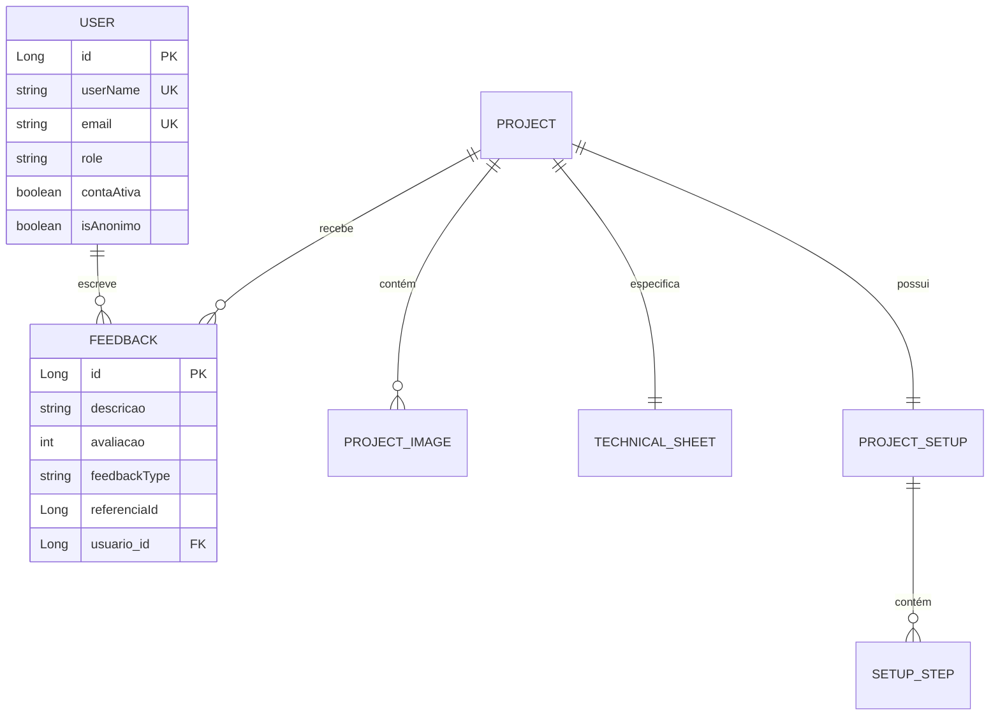

<div align="center">

# 🧑‍💻 BrunoFragaDev — Portfolio API

**API RESTful em produção que serve a plataforma [brunofragadev.com](https://www.brunofragadev.com).**  
Autenticação completa com OAuth2, gerenciamento de portfólio, artigos e sistema de feedbacks.

[](https://openjdk.org/projects/jdk/21/)
[](https://spring.io/projects/spring-boot)
[](https://spring.io/projects/spring-security)
[](https://developers.google.com/identity)
[](https://swagger.io)
[](https://www.brevo.com)
[](https://www.mysql.com)
[](https://github.com/features/actions)
[](./LICENSE)

🔗 **[brunofragadev.com](https://www.brunofragadev.com)** — acesse a plataforma que esta API serve em produção

</div>

---

> ⚡ **Esta API está em produção.** Não é um projeto de estudo abandonado — está rodando, atendendo requisições reais e sendo evoluído ativamente.

---

## 📖 Sobre o Projeto

Backend da plataforma **[brunofragadev.com](https://www.brunofragadev.com)** — portfólio pessoal com autenticação completa, gerenciamento de projetos, artigos e coleta de feedbacks de usuários reais.

O que diferencia este projeto de um CRUD comum:

- **Está em produção** com CI/CD automatizado via GitHub Actions
- **Dois fluxos de autenticação** — credenciais próprias com JWT e login social via Google OAuth2, ambos emitindo tokens da plataforma
- **E-mails transacionais reais** — integração com Brevo API via WebClient para ativação de conta, recuperação de senha e alertas
- **Arquitetura orientada a casos de uso** — cada operação tem sua própria classe com responsabilidade única, sem God Services
- **Domínio isolado de infraestrutura** — o núcleo de negócio não conhece Spring, JPA nem nenhum framework externo

---

## 🏛️ Arquitetura e Decisões de Design

### Clean Architecture + Use Cases com Responsabilidade Única

A decisão mais importante do projeto foi abandonar o padrão `UserService` com dezenas de métodos e adotar **Use Cases individuais**. Cada operação de negócio tem sua própria classe:

```
RegisterUserUseCase         → cadastra um novo usuário e dispara e-mail de ativação
ActivateAccountUseCase      → valida o código de 6 dígitos e ativa a conta
ProcessGoogleLoginUseCase   → processa token do Google e emite JWT da plataforma
RequestPasswordResetUseCase → inicia o fluxo de recuperação enviando código por e-mail
ResetPasswordUseCase        → redefine a senha com o código recebido
UpdateProfileUseCase        → atualiza dados de perfil do usuário autenticado
CreateProjectUseCase        → cria projeto com ficha técnica e galeria
CreateFeedbackUseCase       → registra feedback e notifica o administrador por e-mail
```

O resultado prático: cada Use Case pode ser testado de forma completamente isolada, sem nenhum mock de framework. Adicionar um novo fluxo não exige tocar em código existente.

---

### Dois Fluxos de Autenticação com um Único Token

O sistema suporta login por credenciais e login social pelo Google. Em ambos os casos, o resultado é um JWT próprio da plataforma — o frontend nunca precisa saber qual fluxo foi usado:

```
Credenciais  →  LoginUseCase           →  JWT da plataforma
Google OAuth2 →  ProcessGoogleLoginUseCase  →  JWT da plataforma
```

Essa decisão isola o frontend de detalhes de autenticação e permite adicionar outros provedores (GitHub, LinkedIn) sem alterar nenhum contrato existente.

---

### Integração com Brevo via WebClient

E-mails transacionais são enviados de forma **não bloqueante** via `WebClient` integrado à API do Brevo. A escolha pelo WebClient em vez do `RestTemplate` garante que o envio de e-mail nunca bloqueia a thread principal da requisição:

| Evento | E-mail disparado |
|---|---|
| Cadastro de usuário | Boas-vindas + código de ativação de 6 dígitos |
| Reenvio de ativação | Novo código de verificação |
| Recuperação de senha | Código de segurança |
| Novo feedback recebido | Alerta para o administrador |

---

### CI/CD com GitHub Actions

O pipeline de deploy está configurado em `.github/workflows` e garante que nenhuma alteração chega à produção sem passar pelo processo de build e validação automatizados.

---

## ⚙️ Funcionalidades

### 🔐 Autenticação (`/auth`)

- Login com credenciais (username/senha) com geração de token JWT
- Login social via Google OAuth2 com emissão de JWT próprio da plataforma
- Verificação de disponibilidade de username e e-mail

### 👤 Usuários (`/usuario`)

- Cadastro com ativação via código de 6 dígitos enviado por e-mail
- Recuperação e redefinição de senha com código de segurança
- Edição de perfil: nome público, profissão, telefone, país, cidade, biografia, links
- Modo anônimo — controle de visibilidade do perfil
- Painel administrativo com listagem paginada e remoção de usuários

### 📁 Projetos (`/projeto`)

- CRUD completo com galeria de imagens, ficha técnica e guia de setup
- Cada projeto possui: título, descrição, status, papel, repositório, URL live
- Ficha técnica: linguagem, paradigma, framework, bibliotecas, infraestrutura
- Guia de setup com passos sequenciais e comandos de terminal

### 📝 Artigos (`/artigo`)

- CRUD completo com suporte a conteúdo extenso, tags e galeria de imagens
- Endpoint dedicado para os 5 artigos mais recentes
- Renderização automática em página exclusiva após publicação

### 💬 Feedbacks (`/feedback`)

- Submissão com nota de 1 a 5, vinculada a projeto, artigo ou à plataforma em geral
- Suporte a feedbacks anônimos — sem autenticação necessária
- Notificação automática por e-mail para o administrador a cada novo feedback
- Moderação e exclusão em massa por referência

### 🛡️ Controle de Acesso (RBAC)

Quatro níveis hierárquicos cumulativos:

```
ADMIN3  →  todas as permissões
ADMIN2  →  ROLE_ADMIN2 + ROLE_ADMIN1 + ROLE_USER
ADMIN1  →  ROLE_ADMIN1 + ROLE_USER
USER    →  acesso autenticado básico
```

---

## 📁 Estrutura de Diretórios

```
src/main/java/com/brunofragadev/
├── module/
│   ├── auth/
│   │   ├── api/               → Controllers e DTOs de autenticação
│   │   └── application/       → Use Cases: Login, GoogleOAuth2, JWT
│   ├── user/
│   │   ├── api/               → Controllers e DTOs
│   │   ├── application/       → Use Cases: Register, Activate, UpdateProfile, RecoverPassword...
│   │   ├── domain/            → Entidade User, Role, exceções de domínio
│   │   └── infrastructure/    → Mappers, Repositories JPA
│   ├── project/
│   │   ├── api/               → Controllers e DTOs
│   │   ├── application/       → Use Cases: CRUD, Galeria, FichaTecnica, Setup
│   │   └── domain/            → Project, ProjectImage, TechnicalSheet, SetupStep
│   ├── article/
│   │   ├── api/               → Controllers e DTOs
│   │   ├── application/       → Use Cases: CRUD, Galeria, Publicação
│   │   └── domain/            → Article, ArticleImage
│   └── feedback/
│       ├── api/               → Controllers e DTOs
│       ├── application/       → Use Cases: Criar, Listar, Moderar, ExcluirEmMassa
│       └── domain/            → Feedback, FeedbackType
├── infrastructure/
│   ├── config/                → Security, Audit, JWT, WebClient
│   ├── email/                 → Integração com Brevo API
│   └── handler/               → Global Exception Handler (@ControllerAdvice)
└── shared/                    → Auditable, VerificationCode
```

---

## 🗄️ Modelo de Dados



---

## ⚙️ Tecnologias

| Categoria | Tecnologia |
|---|---|
| Linguagem | Java 21 |
| Framework | Spring Boot 3.4.2 |
| Segurança | Spring Security + JWT |
| Login Social | Google OAuth2 |
| Persistência | Spring Data JPA / Hibernate |
| Banco de Dados | H2 (dev) / MySQL (produção) |
| Cliente HTTP | Spring WebClient |
| E-mail | Brevo API |
| Documentação | Swagger UI / SpringDoc OpenAPI |
| Build | Maven |
| Validação | Jakarta Bean Validation |
| CI/CD | GitHub Actions |

---

## 🚀 Como Rodar Localmente

### Pré-requisitos

- Java 21+
- Maven 3.9+
- Conta no [Brevo](https://www.brevo.com/) *(opcional em dev)*
- Credenciais do Google OAuth2 *(opcional em dev)*

### 1. Clone o repositório

```bash
git clone https://github.com/brunofdev/brunofragadev-api.git
cd brunofragadev-api/brunofragadev-hml
```

### 2. Configure as variáveis de ambiente

```properties
jwt.secret=sua_chave_secreta_aqui
jwt.expiration=86400000
brevo.api.key=sua_api_key_brevo
spring.security.oauth2.client.registration.google.client-id=seu_client_id
spring.security.oauth2.client.registration.google.client-secret=seu_client_secret
```

### 3. Execute

```bash
mvn spring-boot:run
```

Acesse a documentação interativa em `http://localhost:8080/swagger-ui.html`

---

## 📄 Licença

Este projeto está sob a licença **MIT**. Consulte o arquivo [LICENSE](./LICENSE) para mais detalhes.

---

<div align="center">

Desenvolvido por **[Bruno Fraga](https://www.brunofragadev.com)**

[](https://linkedin.com/in/brunofragadev)
[](https://github.com/brunofdev)
[](https://www.brunofragadev.com)

</div>
